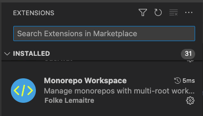
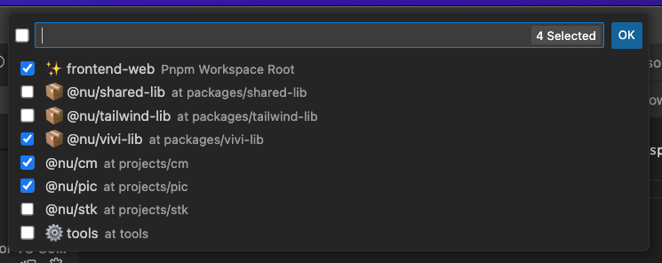
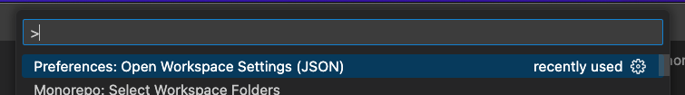

To solve problem that i18n alley will not work when *Monorepo Workspace* enable, you need:

1. Install *Monorepo Workspace*. 
2. Select some space. 
3. Open workspace settings JSON file. 
4. Update settings section.
    ```json
    {
      "folders": [
        // ...
      ],
      "settings": {
        "files.exclude": {
          "projects/*": true,
          "packages/vivi-lib": true,
          "packages/shared-lib": true
        },
        "search.exclude": {
          "**/dist": true,
          "**/prerender": true
        },
        "i18n-ally.localesPaths": [
          "tools/i18n-tool/result",
          "../../tools/i18n-tool/result"
        ],
        "tailwindCSS.experimental.configFile": "../../packages/tailwind-lib/tailwind.config.cjs",
        "scss.lint.unknownAtRules": "ignore"
      }
    }
    ```
