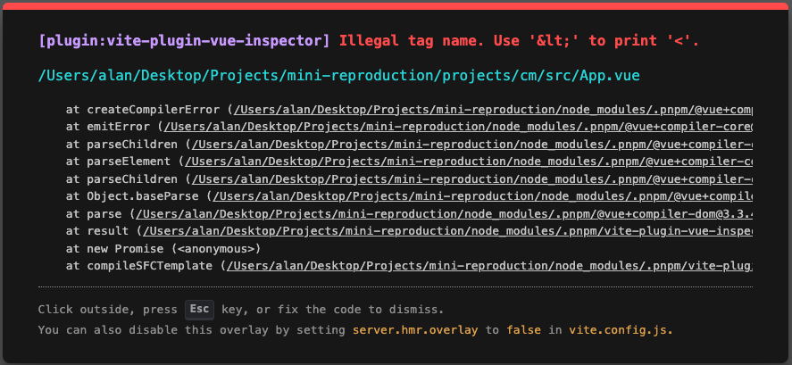

# Vue Devtool Bug Reproduction with Pug
<!-- Give me a README template -->
## Description
This is a bug reproduction for new Vue Devtool. When it's used with Pug, vite-plugin-vue-inspector will throw a critical error.

## Steps to reproduce
1. Clone this repo
2. Run `pnpm install`
3. Run `pnpm run cm`
4. Then the bug will be reproduced

## Expected result
The Project could be run without any error
## Actual result


## Environment
- OS: MacOS Ventura 13.4（22F66）
- Node: v16.20.2
- PNPM: 8.9.2
- Vue: ^3.3.4
- Vue Devtool: ^7.0.13
```
